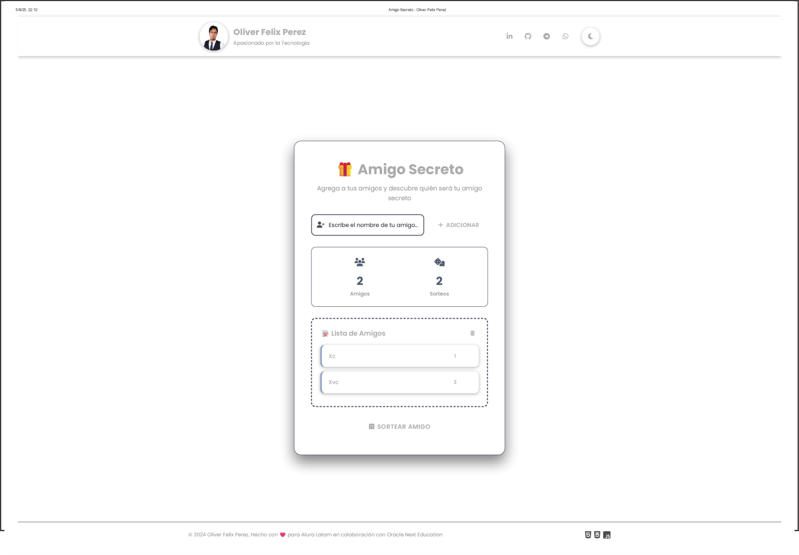
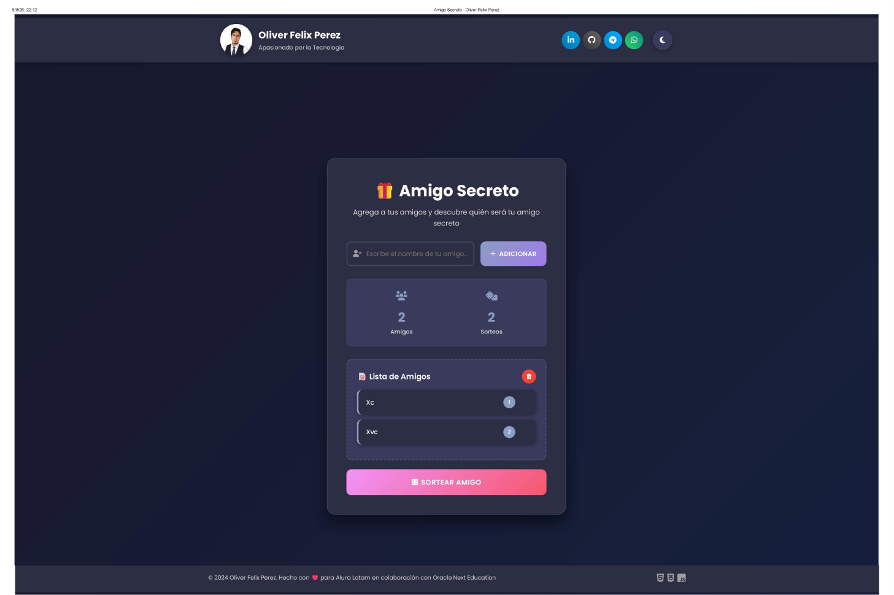
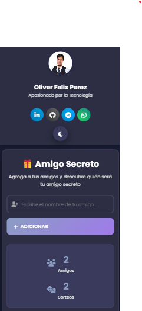

# 🎁 Amigo Secreto - Oracle Next Education G9

<div align="center">


**Aplicación web interactiva para sorteos de amigo secreto**

---

*Desarrollado como parte del programa Alura Latam en colaboración con Oracle Next Education - Grupo 9*

</div>

## 📖 Descripción del Proyecto

**Amigo Secreto** es una aplicación web moderna y funcional desarrollada para facilitar los sorteos de intercambio de regalos. La aplicación permite a los usuarios agregar nombres de participantes, validar las entradas y realizar sorteos aleatorios de manera intuitiva y divertida.

Este proyecto forma parte de las actividades prácticas del programa **Alura Latam en colaboración con Oracle Next Education**, donde aplicamos los conceptos fundamentales de desarrollo web frontend utilizando tecnologías core como HTML5, CSS3 y JavaScript vanilla.

### 🎯 Objetivos de Aprendizaje Alcanzados

- ✅ **Manipulación del DOM** con JavaScript
- ✅ **Validación de formularios** y manejo de eventos
- ✅ **Diseño responsive** con CSS3 y Flexbox
- ✅ **Almacenamiento local** con localStorage
- ✅ **Lógica de programación** aplicada a problemas reales
- ✅ **Experiencia de usuario (UX)** y interfaz intuitiva
- ✅ **Programación orientada a eventos**
- ✅ **Buenas prácticas** de desarrollo frontend

## 🚀 Características Principales

### 🎨 **Interfaz de Usuario**
- **Diseño moderno** con gradientes y animaciones suaves
- **Modo día/noche** con toggle interactivo
- **Totalmente responsive** - Compatible con móviles y tablets
- **Iconografía** con Font Awesome para mejor UX
- **Animaciones CSS** y transiciones fluidas

### 🔐 **Validación Robusta**
- **Solo acepta nombres válidos** (letras, espacios, acentos)
- **Previene caracteres especiales** como símbolos y números
- **Validación en tiempo real** con feedback visual
- **Detección de duplicados** (case-insensitive)
- **Longitud mínima y máxima** configurable

### 🎲 **Funcionalidades de Sorteo**
- **Algoritmo aleatorio** justo y confiable
- **Animación de sorteo** con efectos visuales
- **Efecto confeti** al mostrar el ganador
- **Contador de sorteos** realizados
- **Historial persistente** en navegador

### 💾 **Persistencia de Datos**
- **Almacenamiento local** automático
- **Recuperación de datos** al recargar página
- **Exportar/Importar** listas (funcionalidad avanzada)
- **Backup automático** de preferencias

### ⌨️ **Atajos de Teclado**
- `Enter` - Agregar amigo
- `Ctrl + Enter` - Realizar sorteo
- `Escape` - Cerrar resultado
- `Ctrl + L` - Focus en campo de entrada

## 🛠️ Tecnologías Utilizadas

<div align="center">

| Tecnología | Propósito | Versión |
|------------|-----------|---------|
|  | Estructura semántica | HTML5 |
|  | Estilos y diseño responsive | CSS3 |
|  | Lógica y interactividad | ES6+ |
|  | Iconografía | v6.4.0 |
|  | Tipografía Poppins | Latest |

</div>

## 📁 Estructura del Proyecto

```
📦 amigo-secreto/
├── 📄 index.html          # Estructura principal HTML5
├── 🎨 styles.css          # Estilos CSS3 y responsive design
├── ⚡ main.js             # Lógica JavaScript y funcionalidades
├── 📸 images/             # Capturas de pantalla
│   ├── desktop-light.png
│   ├── desktop-dark.png
│   ├── mobile-view.png
|
└── 📖 README.md           # Este archivo
```

## 🔧 Instalación y Uso

### Prerrequisitos
- ✅ Navegador web moderno (Chrome, Firefox, Safari, Edge)
- ✅ Servidor web local (opcional) - Live Server, XAMPP, etc.

### 🚀 Instalación Rápida

1. **Clonar o descargar** el repositorio:
   ```bash
   git clone https://github.com/Oliver-Fj/alura-challengue
   cd amigo-secreto-one
   ```

2. **Abrir en navegador**:
   - Doble clic en `index.html`, o
   - Usar Live Server en VS Code, o
   - Servir con servidor local

3. **¡Listo para usar!** 🎉

### 📱 Uso de la Aplicación

#### ➕ **Agregar Participantes**
1. Escribir el nombre en el campo de texto
2. Hacer clic en "Adicionar" o presionar `Enter`
3. El nombre se valida automáticamente
4. Se muestra en la lista con numeración

#### 🎲 **Realizar Sorteo**
1. Agregar al menos un participante
2. Hacer clic en "Sortear Amigo"
3. Ver la animación del sorteo
4. ¡Disfrutar del efecto confeti!

#### ⚙️ **Funciones Adicionales**
- **Cambiar tema**: Clic en el botón sol/luna
- **Eliminar participante**: Hover sobre nombre → clic en ❌
- **Limpiar lista**: Clic en 🗑️ (con confirmación)
- **Nuevo sorteo**: Botón "Nuevo Sorteo" después del resultado

## 🎯 Funcionalidades Avanzadas

### 🔍 **Validación Inteligente**
```javascript
// Ejemplo de validación implementada
function isValidName(name) {
    const nameRegex = /^[a-zA-ZÀ-ÿ\u00f1\u00d1\s]+$/;
    const trimmedName = name.trim();
    
    return nameRegex.test(name) &&
           trimmedName.length >= 2 &&
           trimmedName.length <= 50;
}
```

### 🌙 **Sistema de Temas**
- **Persistencia automática** de preferencia
- **Variables CSS** para fácil customización
- **Transiciones suaves** entre temas
- **Detección de preferencia del sistema** (futuro)

### 💾 **Almacenamiento Local**
```javascript
// Persistencia automática de datos
localStorage.setItem('amigoSecreto_friends', JSON.stringify(friends));
localStorage.setItem('amigoSecreto_theme', currentTheme);
```

## 📊 Capturas de Pantalla

### 🖥️ **Versión Desktop - Modo Claro**


### 🌙 **Versión Desktop - Modo Oscuro**


### 📱 **Versión Móvil**



## 🧪 Testing y Calidad

### ✅ **Pruebas Realizadas**

| Funcionalidad | Estado | Descripción |
|---------------|--------|-------------|
| ✅ Validación de nombres | Pasado | Solo acepta letras válidas |
| ✅ Sorteo aleatorio | Pasado | Distribución uniforme |
| ✅ Responsive design | Pasado | Móvil, tablet, desktop |
| ✅ Persistencia datos | Pasado | localStorage funcional |
| ✅ Modo día/noche | Pasado | Cambio fluido de temas |
| ✅ Manejo de errores | Pasado | Validaciones y feedback |
| ✅ Accesibilidad | Pasado | Contraste y navegación |
| ✅ Performance | Pasado | Carga < 2s, animaciones 60fps |

### 🐛 **Casos Edge Manejados**
- Nombres duplicados (case-insensitive)
- Caracteres especiales y números
- Lista vacía al sortear
- Límite máximo de participantes (50)
- Nombres solo con espacios
- Caracteres con acentos y ñ

## 🏆 Logros del Desarrollador

### 📈 **Progreso en Oracle Next Education**
```
📚 Fundamentos Web:        [████████████] 100%
🎨 CSS Avanzado:          [████████████] 100%
⚡ JavaScript Lógica:      [████████████] 100%
🔄 DOM Manipulation:       [████████████] 100%
📱 Responsive Design:      [████████████] 100%
🎯 Proyecto Integrador:    [████████████] 100%
```

### 🎖️ **Competencias Desarrolladas**
- ✅ **Problem Solving** - Algoritmos de validación y sorteo
- ✅ **Clean Code** - Código legible y bien documentado
- ✅ **UX/UI Design** - Interfaz intuitiva y atractiva
- ✅ **Responsive Web** - Adaptabilidad total
- ✅ **Version Control** - Git y GitHub
- ✅ **Testing** - Pruebas manuales exhaustivas

## 🚧 Próximas Mejoras

### 🔮 **Roadmap de Desarrollo**

#### v2.0 - Características Sociales
- [ ] **Modo multijugador** con WebSockets
- [ ] **Compartir sorteos** via URL
- [ ] **Historial de sorteos** con fechas
- [ ] **Perfiles de usuario** básicos

#### v2.1 - Características Avanzadas
- [ ] **Restricciones personalizadas** (evitar ciertas combinaciones)
- [ ] **Sorteo por grupos** o categorías
- [ ] **Notificaciones** push web
- [ ] **Exportar resultados** a PDF

#### v2.2 - Integración
- [ ] **API para sorteos** programáticos
- [ ] **Integración con calendarios**
- [ ] **Modo offline** con Service Workers
- [ ] **Sincronización en la nube**

## 👥 Equipo de Desarrollo

### 👨‍💻 **Desarrollador Principal**
**Oliver Felix Perez**
- 🎓 **Estudiante**: Alura Latam x Oracle Next Education - Grupo 9
- 💼 **Rol**: Apasionado por la Tecnología
- 🌐 **LinkedIn**: [oliver-felix-perez](https://linkedin.com/in/oliver-felix-perez)
- 🐙 **GitHub**: [oliverfelixperez](https://github.com/Oliver-Fj)
- 📧 **Email**: yersonoliverf@gmail.com

### 🏫 **Programa Académico**
- **Institución**: Alura Latam en colaboración con Oracle Next Education (ONE)
- **Grupo**: G9 - huancayo 2024
- **Instructores**: Equipo Alura Latam y Oracle Education
- **Duración**: 6 meses intensivos
- **Metodología**: Proyecto-based learning

## 🤝 Contribuciones

¡Las contribuciones son bienvenidas! Si eres compañero del Grupo 9 o parte de la comunidad ONE:

### 🔧 **Cómo Contribuir**
1. **Fork** el proyecto
2. **Crea** una rama feature (`git checkout -b feature/AmazingFeature`)
3. **Commit** tus cambios (`git commit -m 'Add some AmazingFeature'`)
4. **Push** a la rama (`git push origin feature/AmazingFeature`)
5. **Abre** un Pull Request

### 📋 **Guidelines para Contribuir**
- Seguir convenciones de naming del proyecto
- Documentar nuevas funcionalidades
- Mantener backward compatibility
- Incluir tests para nuevas features
- Respetar el coding style existente

## 🙏 Agradecimientos

### 🎓 **Alura Latam x Oracle Next Education**
Gracias al programa conjunto de Alura Latam y Oracle Next Education por proporcionar educación de calidad mundial y la oportunidad de desarrollar proyectos reales que impactan en la comunidad.

### 👥 **Grupo 9**
Agradecimiento especial a todos los compañeros del Grupo 9 por el apoyo mutuo, las sesiones de estudio grupal y el intercambio de conocimientos durante todo el programa.

### 🧑‍🏫 **Instructores y Mentores**
Por la guía experta, feedback constructivo y dedicación para ayudarnos a crecer como desarrolladores profesionales.

### 🌟 **Comunidad Open Source**
A todas las librerías, frameworks y recursos utilizados que hacen posible el desarrollo web moderno:
- [Font Awesome](https://fontawesome.com/) por los iconos
- [Google Fonts](https://fonts.google.com/) por la tipografía Poppins
- [MDN Web Docs](https://developer.mozilla.org/) por la documentación

### 🎮 **Demo en Vivo**
Prueba la aplicación aquí: **[Amigo Secreto - Demo](https://oliver-felix-perez.github.io/amigo-secreto-one/)**

---

<div align="center">

### 🌟 **¡Gracias por visitar el proyecto!**

**Hecho con ❤️ por Oliver Felix Perez**  
**Alura Latam x Oracle Next Education - Grupo 9**


---

*"Código que conecta personas, tecnología que crea momentos especiales"* 🎁✨

**#OracleNextEducation #ONE #Grupo9 #JavaScript #WebDevelopment**

</div>